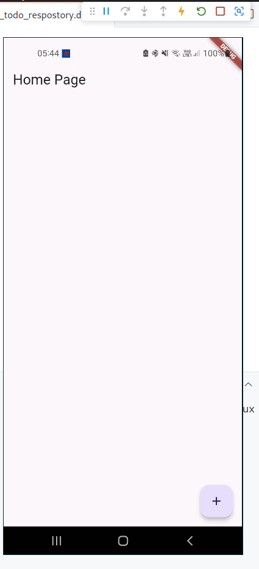

# testeboaldo

Projeto utilizando [ASP](https://asp.flutterando.com.br/) como gerenciador de estado, repository, [auto_injector](https://pub.dev/packages/auto_injector), [shared_preferences](https://pub.dev/packages/shared_preferences) e [localstore](https://pub.dev/packages/localstore) como alternativa.

Exemplo retirado do canal da [Flutterando](https://youtu.be/skRXcUbCEcI) e atualizado para versão 2.0 do [ASP](https://asp.flutterando.com.br/). 

